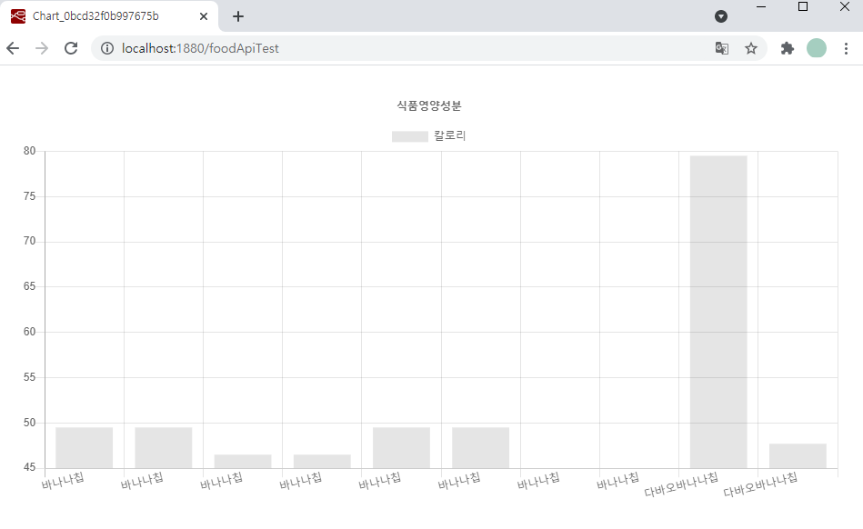

### Node 설명

1. `http-request` 노드로 공공데이터 포털의 식품영양성분 정보를 Open API을 사용해 `xml` 형식으로 받아온다.
2. 개발한 `xml-formatter-food-test` 노드로 chart.js로 그릴 수 있게, xml 형식의 데이터를 JavaScript Object로 포매팅해준다.
3. `http://localhost:1880/foodApiTest`로 접속하여 그려진 차트를 확인한다.
4. 그러나 x축에는 상품 정보, y축에는 칼로리가 들어가도록 `xml-formatter-food-test` 노드 코드 상에 변수로 고정시켜놨다. HTML form으로 입력해서 그려주고 싶은데 어떻게 해야 할지 잘 모르겠다!!!

### 차트 결과

