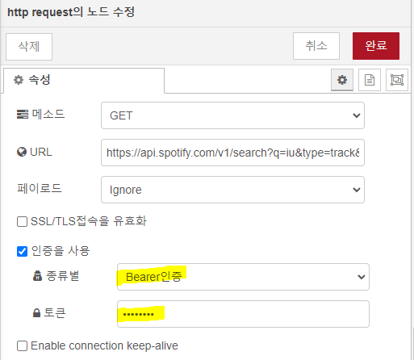
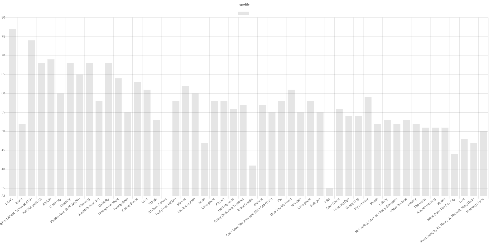

 

Spotify API 사용하여 flow 그리기

✔ 회원 가입과 key 발급

1. Spotify for Developers 회원 가입 후 Dashboard 로그인
   - https://developer.spotify.com/dashboard/applications
2. Dashboard 생성 -> `Users And Access` -> key 발급받기
   - Client ID, Client Secret (show client secret 눌러야 보임) 복사
3. access_token 발급받기 -> 유효기간이 짧으니 테스트 할 때 마다 발급받아야 함
   - `get_token.py ` 출력값 복사
4. access_token은 추후 `http-request` node 사용 시, bearer 인증 선택 후 입력한다.



✔ Search API 사용

- 설명 : https://developer.spotify.com/documentation/web-api/reference/#category-search
- 우리는 `track`으로 검색해서 곡 제목 (`name`)과 인지도 (`popularity`)를 차트화에 사용한다.
  - `popularity` : The popularity of the artist. The value will be between 0 and 100, with 100 being the most popular. The artist’s popularity is calculated from the popularity of all the artist’s tracks.

- parameters : 

  ```json
  {
      'q' : '아티스트 명',
      'type': 'track',
      'limit': 50
  }
  
  ```

  

✔ `Data-formatter` node + `chart.js`로 flow 사용

- x_data : name
- y_data : popularity


